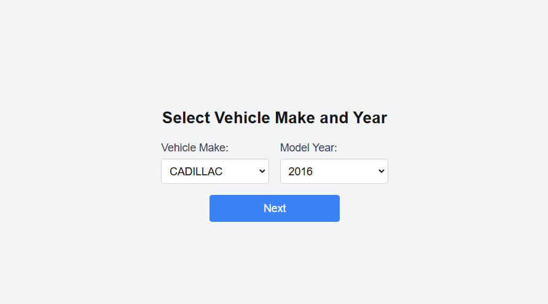
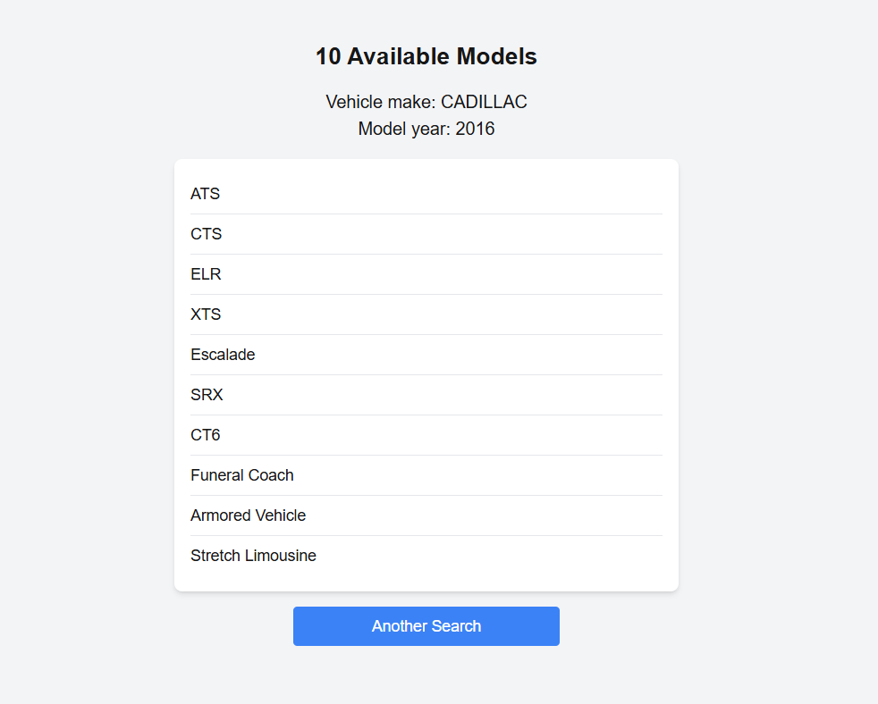
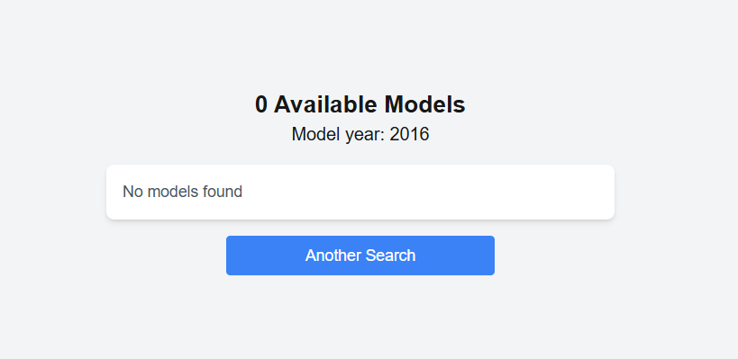

# Car Model Searcher

Have a try! [Car Dealer App](https://car-dealer-app-develops-today.vercel.app/)

This project is being developed for **DevelopsToday** as part of the selection process. It is a car model searcher application built with Next.js, allowing users to search for car models by year and brand.

## Features

- Search for car models by **year** and **maker**.
- Fast and responsive user interface.
- Another Search Button
- **Client-side rendering** on the Home page for a smooth, interactive experience.
- **Server-side rendering** on the Results page for better SEO and performance.
- **Code quality tools**: Includes **ESLint** and **Prettier** configurations for clean and consistent code.

## Technologies Used

- **Next.js** (v15.0.3)
- **React**
- **Tailwind CSS**
- **ESLint** - For identifying and fixing code issues.
- **Prettier** - For code formatting and consistency.

### Images

**Home**


**Results**


**NotFound**


## Getting Started

To get started with the project, follow the steps below:

### Prerequisites

- Ensure you have **Node.js** and **npm** (or **yarn**) installed on your machine.

### Installation

1. Clone the repository to your local machine:

    ```bash
    git clone https://github.com/yourusername/car-model-searcher.git
    ```

2. Navigate into the project directory:

    ```bash
    cd car-model-searcher
    ```

3. Install the dependencies:

    ```bash
    npm install
    # or
    yarn install
    ```

### Running the Project

Once the dependencies are installed, you can run the application locally:

```bash
npm start
# or
yarn start
